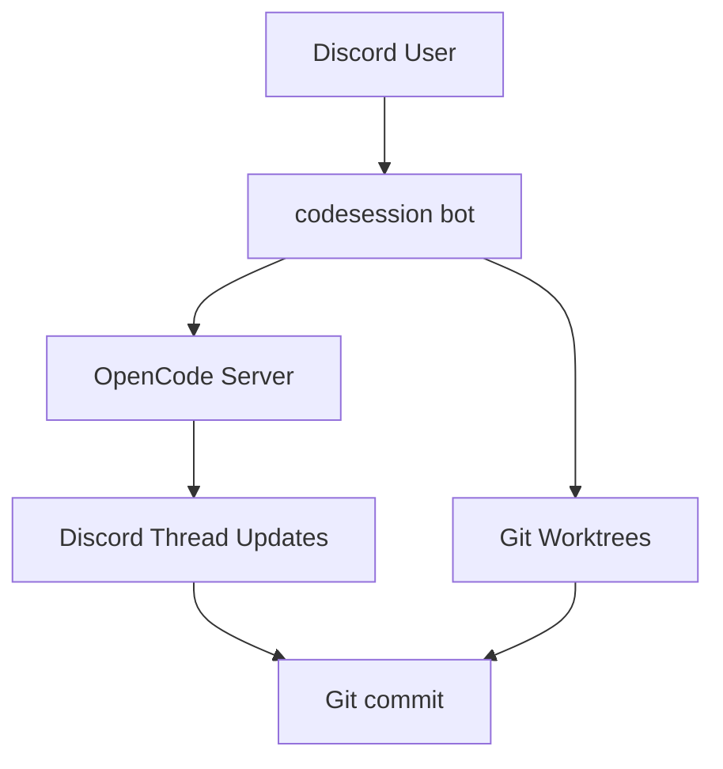

# codesession - collaborative development from discord

This is a Discord bot to enable collaborative development from Discord via [opencode](https://opencode.ai).

## How it Works

Technical flow: 
1. **Bot startup**: Starts OpenCode server and listens to `/events` SSE stream
2. **Slash commands**: Create Discord threads and send commands to OpenCode server  
3. **SSE events**: Every event from OpenCode is pushed to the corresponding Discord thread
4. **Git operations**: Isolated worktrees for each session with commits to repository

## Features
- **Agentic AI from Discord**: Control agentic AI from Discord with opencode.
- **Session and Repository Management**: Persistent session data and git worktree management.
- **Multi-Model Support**: Configure multiple AI models for different tasks.
- **Commit Summarization**: Automated commit message generation with customizable prompts.

## Available Commands
- `/ping`: Just reply with pong.
- `/codesession`: Start new session (create new worktree).
- `/diff`: Show diff of current worktree.
- `/commit`: Generate commit message and push to remote.

## Quick Start

1. **Download**: Get the latest release for your platform from the [releases page](https://github.com/famasya/codesession/releases)
2. **Configure**: Copy `config.example.toml` to `config.toml` and add your Discord bot token
3. **Install**: See [INSTALLATION.md](INSTALLATION.md) for detailed installation and daemon setup instructions

## Configuration

The bot uses TOML configuration with support for:
- Discord bot token
- OpenCode server settings
- Multiple AI model providers (OpenRouter, OpenCode, whatever Opencode support)
- Repository paths and settings
- Logging levels
- Custom commit summarizer instructions

See `config.example.toml` for a complete configuration template.

## License

MIT
