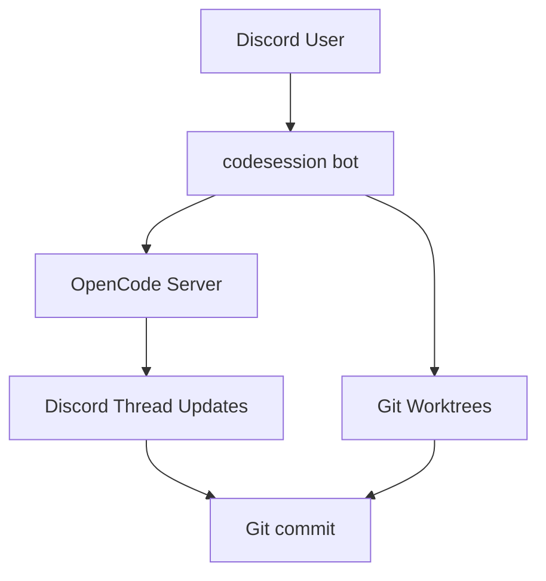

# codesession - collaborative development from discord

This is a Discord bot to enable collaborative development from Discord via [opencode](https://opencode.ai).

## How it Works

Technical flow: 
1. **Bot startup**: Starts OpenCode server and listens to `/events` SSE stream
2. **Slash commands**: Create Discord threads and send commands to OpenCode server  
3. **SSE events**: Every event from OpenCode is pushed to the corresponding Discord thread
4. **Git operations**: Isolated worktrees for each session with commits to repository

## Features
- **Agentic AI from Discord**: Control agentic AI from Discord with opencode.
- **Session and Repository Management**: Persistent session data and git worktree management.
- **Multi-Model Support**: Configure multiple AI models for different tasks.
- **Commit Summarization**: Automated commit message generation with customizable prompts.

## ⚠️ Important Warnings

### Repository Branch Matching
**The reference repository must be on the correct target branch before starting codesession.**

When you start a new codesession, it will:
- Run `git pull` on the current branch of your reference repository
- Create new worktrees based on that branch
- All coding sessions will branch from whatever branch you're currently on

**Example:**
- If you want codesession to work on `release` branch → checkout `release` in your reference repository first
- If you want codesession to work on `main` branch → checkout `main` in your reference repository first

### Git Hooks Are Skipped
**Commits made by codesession will skip git hooks.**

All commits use the `--no-verify` flag, which means:
- Pre-commit hooks will NOT run
- Commit-msg hooks will NOT run
- This is intentional to avoid blocking automated commits

If your project relies on git hooks for formatting, linting, or validation, you may need to run these checks manually after codesession commits.

## Available Commands
- `/ping`: Just reply with pong.
- `/codesession`: Start new session (create new worktree).
- `/diff`: Show diff of current worktree.
- `/commit`: Generate commit message and push to remote.

## Quick Start

1. **Download**: Get the latest release for your platform from the [releases page](https://github.com/famasya/codesession/releases)
2. **Configure**: Copy `config.example.jsonc` to `config.jsonc` and add your Discord bot token
3. **Install**: See [INSTALLATION.md](INSTALLATION.md) for detailed installation and daemon setup instructions

## Development

This project uses [Task](https://taskfile.dev/) for development workflow management. Make sure you have Task installed (`go install github.com/go-task/task/v3/cmd/task@latest`). See [Taskfile.yml](Taskfile.yml) for available tasks.

## Configuration

The bot uses JSONC (JSON with comments) configuration with support for:
- Discord bot token
- OpenCode server settings
- Multiple AI model providers (OpenRouter, OpenCode, whatever Opencode support)
- Repository paths and settings
- Logging levels
- Custom commit summarizer instructions

See `config.example.jsonc` for a complete configuration template.

## License

MIT
